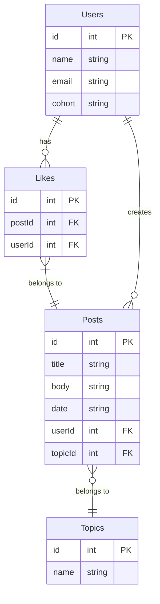

```mermaid
erDiagram
    Users ||--o{ Likes : "has"
    Likes }|--|| Posts : "belongs to"
    Users ||--o{ Posts : "creates"
    Posts }o--|| Topics : "belongs to"

    Users {
        id int "PK"
        name string
        email string
        cohort string
    }

    Posts {
        id int "PK"
        title string
        body string
        date string
        userId int "FK"
        topicId int "FK"
    }

    Topics {
        id int "PK"
        name string
    }

    Likes {
        id int "PK"
        postId int "FK"
        userId int "FK"
    }
```